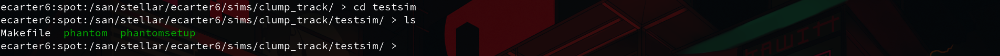

# Guide to PHANTOM (SPH CODE)

## Introduction

PHANTOM is a *Smoothed Particle Hydrodynamics* code. Often this will be abbreviated to *SPH*. Essentially the code solves the equation of hydrodynamics to evolve a system of hundreds-of-thousands to millions of gas particles to probe into the evolution of various astrophysical models. Whilst a range of codes are available, PHANTOM in particular is developed from a planet/star formation point of interest in particular (a large portion of older codes were designed with cosmology in mind).

The code is written in modern fortran (file extension .f90/.F90) which has it's own quirks for development. If there are any questions regarding the inner workings of PHANTOM or general FORTRAN development, please feel free to ask.

For further information on these, check out:

- PHANTOM:
  - Paper - <https://ui.adsabs.harvard.edu/abs/2018PASA...35...31P/abstract>
  - Docs - <https://phantomsph.readthedocs.io/en/latest/>
  - Github - <https://github.com/danieljprice/phantom>
- SPH:
  - Lucy (1977): <https://ui.adsabs.harvard.edu/abs/1977AJ.....82.1013L/abstract>
  - Gingold & Monaghan (1977) - <https://ui.adsabs.harvard.edu/abs/1977MNRAS.181..375G/abstract>

Here, I am going to briefly walk through how to set up and run an example disc simulation using Alison Young's fork of phantom, along with the Radiative Transfer Approximation implemented in that version. 

For further information, please refer to the following:

 - Method paper for Alison's cooling method (also compares the methods) - <https://ui.adsabs.harvard.edu/abs/2024MNRAS.531.1746Y/abstract>
 - Lombardi cooling method - <https://ui.adsabs.harvard.edu/abs/2015MNRAS.447...25L/abstract>

## Downloading the Code

Here I am assuming that git is installed and configured. This should be available on any STARLINK machine already.

Using git, we can clone the latest version of Alison's fork of PHANTOM. With git installed, we can simply do this by running

    git clone https://github.com/alisonkyoung1/phantom.git

**Note: If you're unable to access this repository, please ask Dimitris and he can arrange for access to be given to you.**

After running `git clone` and the download process is complete, a new folder called **phantom** will appear in your current directory. Now we can look at setting up a simulation.

## Setup

To setup a simulation for phantom on starlink, we need to follow this process:

### Create a setup in phantom/build/Makefile setups

This should hopefully only be something that we have to do *once* unless we need to:

 - Alter the seed for the simulation.
 - Change something within the initial disc setup routine.

 **NOTE: PHANTOM uses both a `set_disc.f90` and a `setup_disc.f90` routine for the setup process. If you need to edit these down the line please ask as I am fairly familiar with these routines now.**

Phantom uses a `Makefile` to tell the compiler exactly which files it needs to compile to set up the program required to run that specific type of simulation. To create this `Makefile`, it uses a script which will use information from a file called `Makefile_setups.f90`. Based on the parmeters within out chosen setup, it will create a `Makefile` with the flags required to `make` the code for that particular setup.

First, we'll make our own custom setup here for a non-isothermal disc with gravity on. For this, we'll need to add our own entry to `Makefile_setups`. We can find `Makefile_setups` in `dir_to_phantom/phantom/build/`, which we can acces via the command line using `cd`, i.e.

    cd dir_to_phantom/phantom/build/

where 'dir_to_phantom' is the path to the directory in which your local copy of phantom is stored. Then we need to open `Makefile_setups` in [your favourite text editor] and add our own custom setup. For this example I'll use gedit, though anything that can edit and save a text file is acceptable.

For ease, we'll add our own custom setup at the top here, though I'd also recommend looking through the avilable setups to see the general format for making other setups in the future (if required). Now we'll add this custom setup above the first setup:

    ifeq ($(SETUP), mydisc)
    #self-gravitating gas disc
    DISC_VISCOSITY=yes
    SETUPFILE= setup_disc.f90
    ANALYSIS= analysis_disc.f90
    ISOTHERMAL= yes
    PERIODIC = no
    GRAVITY = yes
    KNOWN_SETUP=yes
    MULTIRUNFILE= multirun.f90
    IND_TIMESTEPS=yes
    endif

This setup is used for a *gas disc with gravity enabled*. Other custom setups can be made in a similar way, but let's stick with this for now. Now we can go back to our original directory outside of the source files for phantom, and start running our first disc simulation.

### Create a Makefile

Now we'll look at compiling the code and setting up all the necerssary files. I'd recommend doing this in a new directory.

Before we can compile phantom, we need to create a `Makefile` using our new custom setup. For this we'll use the following line:

    dir_to_phantom/phantom/scripts/writemake.sh mydisc > Makefile

This will run a shell script from phantom to generate a `Makefile` using our custom 'mydisc' setup. Any known setup in `Makefile_setups` could be substituted for 'mydisc' here.

### Initialise a BASH environment and initialise intelOneapi

NOTE: THIS IS SPECIFICALLY IF YOU INTEND TO USE THE INTEL FORTRAN COMPILER ON THE STARLINK NETWORK. I RECOMMEND THIS OVER `gfortran`, AS FROM EXPERIENCE `ifort` IS TYPICALLY FASTER.

**UPDATE: In the latest versions of PHANTOM, I have not been able to compile PHANTOM with `gfortran` due to the inclusion of features not available with the compiler. `ifort` has been depreciated by intel, but seems to remain the best option still currently. `ifx` is also available on machines with the latest version of the intel fortran toolkit, though I do not have significant experience working with this.**

To compile the code, first we need to initalise the intelOneapi toolkit so we can use their fortran compiler, `ifort`. To do this we need to first enter a bash environment simply by typing `bash` into the terminal. The command line should now look like this:

Then we can initialise the intelOneapi toolkit using:

    source /opt/intel/oneapi/setvars.sh

We only need to do this *once* per bash environment.

### Compile the code

Once this process is complete, we can compile `phantom`, the main code, and `phantomsetup` using:

    export SYSTEM=ifort
    make; make setup

Note that even if we need to recompile using `make; make setup`, we only need to run `export SYSTEM=ifort` *once*.

This will take a few minutes, but should compile `phantom` and `phantomsetup`. Depending on your terminal emulator, these may appear a different colour or bold.

### Generate the initial files

Now we can generate our .setup using `phantomsetup`:

    ./phantomsetup disc.setup

Any name for the .setup file can be used here, but I would recommend something sensible (i.e. run1_100au_disc) for production runs in the future. This will start an interactive setup prompt which will ask for a few prameters, but for now we will just press **ENTER** and take the default value for each one, as all of these parameters can be altered in the `disc.setup` file later. Then we can open the setup file in [your favourite text editor]. We'll see a bunch of options here, but we'll focus on a few for now.

 - `np` - Number of particles. For test simulations I'd stick around the 50,000-100,000 range.
 - `m1` - Sets the star mass. The default here is **solar masses**.
 - `R_in` - Sets the inner disc radius. The default here is **AU**.
 - `R_ref` - Sets the reference radius. This is relevant for the `H/R` parameter.
 - `r_out` - Outer disc radius.
 - `disc_m` - Sets the disc mass The default here is **solar masses**. 
 - `pindex` - The power law index for surface density. **We'll set this to 1.5**.
 - `H_R` - The parameter for H/R in the disc at `R_ref`. This along with `R_Ref` sets the initial temperature profile of the disc. **Here we'll use H_R=0.0556**.
 - `nplanets` - Set the number of planets. **We can leave this at 0**.

For now, let's set up a 0.8 star mass and a 0.6 disc mass with 50000 particles and an outer disc radius of 100AU. Once the setup file is ready, we can save it and run

    ./phantomsetup disc.setup

Again to create the rest of the files needed to run PHANTOM. The most important here is `disc.in`, where we will set the rest of the parameters for our infile. If we open `disc.in` in [your favourite text editor], there's a few parameters that we commonly need to edit.

- `tmax` - The end time for the simulation. This will be set automatically through the "simulate for number of orbits" prompt during the first run of `./phantomsetup`. **For a test simulation, we can lower this to 1E+04 or shorter**.
- `dtmax` - The time between dumpfiles. **We can set this to a lower value on the order of 100 years or so, to see what's happening in the simulation**.
- `nfulldump` - Set how often PHANTOM writes out a 'full' dump. PHANTOM either writes out a partial dump with limited information or a fulldump with information for an array of useful parameters on all particles. A partial dump will be faster to write-out than a fulldump, but it's important to know that **PHANTOM CAN ONLY RESTART SIMULATIONS FROM A FULLDUMP**. **We'll set this to 1 here, so phantom outputs a fulldump every dump.**
- `alpha` - Set the alpha viscocity parameter.
- `ieos` - Set the equation of state. Common options are 1=isothermal, 2=adiabatic and 8=barotropic. See `phantom/src/main/eos.F90` or the PHANTOM documentation for more information on the equations of state available. **For our use case, we'll be using `ieos=23`. I'll update this if the option changes again**.
- `icooling` - Set which type of cooling to use. It should be fine to leave this as default whilst getting used to the code. See `phantom/src/main/cooling.F90` for more infomation on the different types of cooling avilable.
- `icreate_sinks` - Turn on sink particle creation. If a particle's density reaches above a certain threshold, PHANTOM will create a new sink particle. This is a binary option, so 0=off and 1=on.

For now, let's set `nfulldump=1`, `ieos=23` (radapprox), and `icooling=9` and leave everything else as is.

After editing and saving `disc.in`, we can run `phantom` using

    ./phantom disc.in

As we have changed some things, PHANTOM will complain as it is missing some information for the new equation of state we have selected. It will output some information and then rewrite `disc.in` with entries for the new parameters it needs.

We can then edit the rest of the parameters for the cooling method, found under the **options controlling cooling** heading:

 - `EOS_file` - Name of the required file containing the opacity table for the cooling method. Depending on the cooling method, a different table should be used. **Typically I just rename my file to the default file name, `myeos.dat`.**
 - `OD method` - The method used to calculate the optical depth. **For the Lombardi method, we use option 2**.
 - `Lstar` - Luminosity of host star for background radiation. **Here we'll set this to 0.**
 - `do FLD` - Adds Flux-Limited-Diffusion. I've not used this personally, so **we'll set this to 0.**
 - `Tfloor` - Temperature floor in Kelvin. **We'll set this to 10.**

### Run the Code.

We can finally run the simulation by once again using

    ./phantom disc.in

And the simulation should begin. It'll output some initial information and give some output each timestep, and the code can be left until the simulation is finished. **WARNING: IF YOU ARE NOT USING SCREEN OR NOHUP OR SOME SIMILAR METHOD OF RUNNING PHANTOM AS A BACKGROUND PROCESS, DO NOT LET YOUR DEVICE GO TO SLEEP OR CLOSE THE TERMINAL AS IT WILL STOP THE SIMULATION**.

Each timestep it'll write out a fulldump, but these files cannot be opened directly. Once the simulation is complete we should have a series of dumps/snapshots available.
