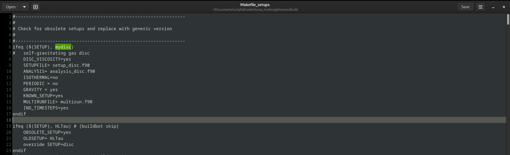

# Guide to PHANTOM (SPH CODE)

## Introduction

PHANTOM is a *Smoothed Particle Hydrodynamics* code. Often this will be abbreviated to *SPH*. Essentially the code solves the equation of hydrodynamics to evolve a system of hundreds-of-thousands to millions of gas particles to probe into the evolution of various astrophysical models. Whilst a range of codes are available, PHANTOM in particular is developed from a planet/star formation point of interest in particular (a large portion of older codes were designed with cosmology in mind). The code is written in modern fortran (file extension .f90/.F90), a fairly old but fast programming language.

For further information on these, check out:

- PHANTOM:
  - Paper - <https://ui.adsabs.harvard.edu/abs/2018PASA...35...31P/abstract>
  - Docs - <https://phantomsph.readthedocs.io/en/latest/>
  - Github - <https://github.com/danieljprice/phantom>
- SPH:
  - Lucy (1977): <https://ui.adsabs.harvard.edu/abs/1977AJ.....82.1013L/abstract>
  - Gingold & Monaghan (1977) - <https://ui.adsabs.harvard.edu/abs/1977MNRAS.181..375G/abstract>

## Downloading the Code

First of all, I highly recommend making a github account (<https://github.com/join>). It's far easier long-term to become familair with the basic usage of github now rather than later, and once set up it's a quick and easy way to:

- Download the code straight from the repository
- Keep it up to date using `git pull`
- Fork your own version for development (if required)
- Have some form of version control for your own code
- **BACKUP ANY CODE YOU HAVE WRITTEN REGULARLY**

Once you have an account (and git installed on the machine you are using; any machine on the starlink network will have git installed already), we can clone, *i.e. make a copy of*, the current version of PHANTOM. With git installed, we can simply do this by running

    git clone https://github.com/danieljprice/phantom.git

Note that any repository (*project that holds code on github*) can be cloned this way, just be replacing the url with the one for that project. After running `git clone` and the download process is complete, a new folder called **phantom** will appear in your current directory. Now we can look at setting up a simulation.

## Setup

*NOTE: I WILL ASSUME THAT YOU ARE CURRENTLY EITHER USING YOUR OWN LINUX/MAC ENVIRONMENT OR ARE ALREADY LOGGED INTO THE STARLINK NETWORK. IF YOU ARE UNSURE HOW TO ACCESS THIS OR NAVIGATE DIRECTORIES VIA COMMAND LINE PLEASE ADDRESS THAT FIRST

To setup a simulation for phantom on starlink, we need to follow this process:

### Create a setup in phantom/build/Makefile setups (once only)

This should hopefully only be something that we have to do *once*, so I'll walk through the process for a typical non-isothermal disc simulation here. Phantom uses a `Makefile` to tell the compiler exactly which files it needs to compile to set up the compiled program required to run that specific type of simulation. To create this `Makefile`, it uses a script which will use information from a file called `Makefile_setups` which will create a `Makefile` with the flags required to `make` the code for that particular setup.

First, we'll make our own custom setup here for a non-isothermal disc with gravity on. For this, we'll need to add our own entry to `Makefile_setups`. We can find `Makefile_setups` in `dir_to_phantom/phantom/build/`, which we can acces via the command line using `cd`, i.e.

    cd dir_to_phantom/phantom/build/

where 'dir_to_phantom' is the path to the directory in which your local copy of phantom is stored. Then we need to open `Makefile_setups` in [your favourite text editor] and add our own custom setup. For this example I'll use gedit, though anything that is can edit and save a text file is acceptable.

For ease, we'll add our own custom setup at the top here, though I'd also recommend looking through the avilable setups to see the general format for making other setups in the future (if required). Now we'll add this custom setup above the first setup:

    ifeq ($(SETUP), mydisc)
    #self-gravitating gas disc
    DISC_VISCOSITY=yes
    SETUPFILE= setup_disc.f90
    ANALYSIS= analysis_disc.f90
    ISOTHERMAL= yes
    PERIODIC = no
    GRAVITY = yes
    KNOWN_SETUP=yes
    MULTIRUNFILE= multirun.f90
    IND_TIMESTEPS=yes
    endif

This setup is used for a *gas disc with gravity enabled*. Other custom setups can be made in a similar way, but let's stick with this for now. Now we can go back to our original directory outside of the source files for phantom, and start running our first disc simulation.

### Create a Makefile

Now we'll look at compiling the code and setting up all the necerssary files. I'd recommend doing this in a new directory. Running `mkdir testsim; cd testsim` will make a 'testsim' directory and then move into it.

Before we can compile phantom, we need to create a `Makefile` using our new custom setup. For this we'll use the following line:

    dir_to_phantom/phantom/scripts/writemake.sh mydisc > Makefile

This will run a shell script from phantom to generate a `Makefile` using our custom 'mydisc' setup. Any known setup in `Makefile_setups` could be substituted for 'mydisc' here.

### Initialise a BASH environment and initialise intelOneapi

NOTE: THIS IS SPECIFICALLY IF YOU INTEND TO USE THE INTEL FORTRAN COMPILER ON THE STARLINK NETWORK. I RECOMMEND THIS OVER `gfortran`, AS FROM EXPERIENCE `ifort` IS TYPICALLY FASTER.

To compile the code, first we need to initalise the intelOneapi toolkit so we can use their fortran compiler, `ifort`. To do this we need to first enter a bash environment simply by typing `bash` into the terminal. The command line should now look like this:

Then we can initialise the intelOneapi toolkit using:

    source /opt/intel/oneapi/setvars.sh

### Compile the code

Once this process is complete, we can compile `phantom`, the main code, and `phantomsetup` using:

    export SYSTEM=ifort
    make; make setup

This will take a few minutes, but should compile `phantom` and `phantomsetup`. Depending on your terminal emulator, these may appear a different colour or bold.

### Generate the initial files

Now we can generate our .setup using `phantomsetup`:

    ./phantomsetup disc.setup

Any name for the .setup file can be used here, but I would recommend something sensible (i.e. run1_100au_disc) for production runs in the future. This will start an interactive setup prompt which will ask a bunch of questions, but for now we will just press **ENTER** for each one. Then we can open the setup file in [your favourite text editor]. We'll see a bunch of options here, but we'll focus on a few for now.

 - *np* - Number of particles. For test simulations I'd stick around the 100,000 mark or smaller. Too small and you won't be able to resolve the features of the disc though.
 - *m1* - Set the star mass.
 - *r_out* - Outer disc radius.
 - *disc_m* - Set the disc mass. 
 - *nplanets* - Set the number of planets

For now, let's set up a 0.8 star mass and a 0.6 disc mass with 50000 particles and an outer disc radius of 100AU. Once the setup file is ready, we can save it and run

    ./phantomsetup disc.setup

Again to create the rest of the files needed to run PHANTOM. The most important here is `disc.in`, where we will set the rest of the parameters for our infile. If we open `disc.in` in [your favourite text editor], there's a few parameters that we commonly need to edit.

- *tmax* - The end time for the simulation. This will be set automatically through the "simulate for number of orbits" prompt during the first run of `./phantomsetup`.
- *nfulldump* - Set how often PHANTOM writes out a 'full' dump. PHANTOM either writes out a partial dump with limited information or a fulldump with information for an array of useful parameters on all particles. A partial dump will be faster to write-out than a fulldump, but it's important to know that **PHANTOM CAN ONLY RESTART SIMULATIONS FROM A FULLDUMP**.
- *alpha* - Set the alpha viscocity parameter.
- *ieos* - Set the equation of state. Common options are 1=isothermal, 2=adiabatic and 8=barotropic. See `phantom/src/main/eos.F90` or the PHANTOM documentation for more information on the equations of state available.
- *icooling* - Set which type of cooling to use. It should be fine to leave this as default whilst getting used to the code. See `phantom/src/main/cooling.F90` for more infomation on the different types of cooling avilable.
- *icreate_sinks* - Turn on sink particle creation. If a particle's density reaches above a certain threshold, PHANTOM will create a new sink particle. This is a binary option, so 0=off and 1=on.

For now, let's set *nfulldump=1*, *ieos=8* (barotropic), and leave everything else as is.

After editing and saving `disc.in`, we can run `phantom` using

    ./phantom disc.in

As we have changed some things, PHANTOM will complain as it is missing some information for the new equation of state we have selected. It will output some information and then rewrite `disc.in` with entries for the new parameters it needs.

As we are using a barotropic equation of state, we set a slope, *gamma* which will determine the relation between temperature and density. For now, set these values as follows:

    # options controlling equation of state
    ieos =           8    ! eqn of state (1=isoth;2=adiab;3=locally iso; 8=barotropic)
    mu =       2.381    ! mean molecular weight
    drhocrit =       0.500    ! transition size between rhocrit0 & 1 (fraction of rhocrit0; barotropic eos)
    rhocrit0 =   1.000E-18    ! critical density 0 in g/cm^3 (barotropic eos)
    rhocrit1 =   1.000E-13    ! critical density 1 in g/cm^3 (barotropic eos)
    rhocrit2 =   3.150E-12    ! critical density 2 in g/cm^3 (barotropic eos)
    rhocrit3 =   2.180E-10    ! critical density 3 in g/cm^3 (barotropic eos)
    rhocrit4 =   1.000E-01    ! critical density 4 in g/cm^3 (barotropic eos)
    gamma1 =       1.667    ! adiabatic index 1 (barotropic eos)
    gamma2 =       1.400    ! adiabatic index 2 (barotropic eos)
    gamma3 =       1.100    ! adiabatic index 3 (barotropic eos)
    gamma4 =       1.100    ! adiabatic index 4 (barotropic eos)

This should *roughly* correspond to an initial turnoff, a turnoff around $T=100K$, and another around $T=2000K$ (dissociation of $H_{2}$). I will not explain how each equation of state works here, but if you need further information please ask.

### Run the Code

Now for the easy part, we can finally run the simulation by once again using

    ./phantom disc.in

And the simulation should begin. It'll output some initial information and give some output each timestep, and the code can be left until the simulation is finished. **WARNING: IF YOU ARE NOT USING SCREEN OR NOHUP OR SOME SIMILAR METHOD OF RUNNING PHANTOM AS A BACKGROUND PROCESS, DO NOT LET YOUR DEVICE GO TO SLEEP OR CLOSE THE TERMINAL AS IT WILL STOP THE SIMULATION**.

Each timestep it'll write out a fulldump, but these files cannot be opened directly. Once the simulation is complete we should have a series of dumps/snapshots available.

### Coming soon: Visualisation in SPLASH

NOTE: I'M HAVING ISSUES USING SPLASH ON STARLINK CURRENTLY, SO PLEASE COME TALK TO ME AND WE CAN RUN THROUGH THIS IN PERSON ONCE THE SIMULATION IS DONE.
